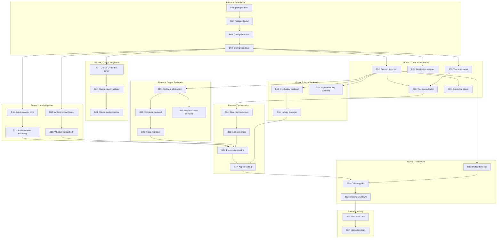

# BEADS.md - Arch Whisper Implementation Beads

**Source:** `docs/plans/initial_plan/TECHNICAL_DESIGN_REVISED.md` (v2.1)
**Generated:** 2026-01-14
**Revised:** 2026-01-14 (Post-review fixes)
**Total Beads:** 32
**Estimated Duration:** ~12 hours

---

## Dependency Graph



---

## Priority Groups

### P0 - Critical Path (Must-have for MVP)
| Bead | Description | Est. |
|------|-------------|------|
| B01 | pyproject.toml | 15m |
| B02 | Package layout | 10m |
| B03 | Config dataclass | 15m |
| B04 | Config load/save | 20m |
| B05 | Session detection | 10m |
| B06 | Notification wrapper | 15m |
| B07 | Tray icon states | 15m |
| B08 | Tray AppIndicator | 25m |
| B09 | Audio ding player | 15m |
| B10 | Audio recorder core | 25m |
| B11 | Audio recorder threading | 20m |
| B12 | Whisper model loader | 20m |
| B13 | Whisper transcribe fn | 20m |
| B14 | X11 hotkey backend | 25m |
| B16 | Hotkey manager | 15m |
| B17 | Clipboard abstraction | 15m |
| B18 | X11 paste backend | 20m |
| B20 | Paste manager | 15m |
| B24 | State machine enum | 10m |
| B25 | App core class | 25m |
| B26 | Processing pipeline | 25m |
| B27 | App threading | 20m |
| B28 | Preflight checks | 20m |
| B29 | CLI entrypoint | 15m |
| B30 | Graceful shutdown | 15m |

### P1 - Extended Support (Wayland + Claude)
| Bead | Description | Est. |
|------|-------------|------|
| B15 | Wayland hotkey backend | 30m |
| B19 | Wayland paste backend | 25m |
| B21 | Claude credential parser | 20m |
| B22 | Claude token validator | 15m |
| B23 | Claude postprocessor | 20m |

### P2 - Quality (Testing)
| Bead | Description | Est. |
|------|-------------|------|
| B31 | Unit tests core | 30m |
| B32 | Integration tests | 30m |

---

## Implementation Phases

### Phase 0: Foundation
**Gate:** `uv run python -c "import arch_whisper"` succeeds

#### B01: Create `pyproject.toml` + `uv.lock`
- **Objective:** Define project metadata/dependencies and lock them with uv
- **Inputs:** Dependency list from TDD Section 5
- **Outputs:** `pyproject.toml` + `uv.lock` at repo root
- **Files:**
  - `pyproject.toml`
  - `uv.lock`
- **Completion Criteria:**
  - [ ] Project name: `arch-whisper`
  - [ ] Python requires: `>=3.10`
  - [ ] All runtime deps from TDD 5.1 listed
  - [ ] TOML parsing: `tomli>=2.0.0` for Python <3.11
  - [ ] Dev deps (pytest, ruff, mypy) in optional group
  - [ ] Console script: `arch-whisper = "arch_whisper.__main__:main"`
  - [ ] `uv lock` produces `uv.lock`
  - [ ] `uv sync --dev` completes successfully
- **Context:**
```toml
[project]
name = "arch-whisper"
version = "0.1.0"
requires-python = ">=3.10"
dependencies = [
    "sounddevice>=0.5.0",
    "numpy>=1.24.0",
    "soundfile>=0.12.0",
    "faster-whisper>=1.0.0",
    "anthropic>=0.40.0",
    "pynput>=1.7.6",
    "evdev>=1.6.0",
    "pyperclip>=1.8.2",
    "tomli>=2.0.0; python_version < '3.11'",
]

[project.optional-dependencies]
dev = [
    "pytest>=7",
    "pytest-mock>=3.10",
    "ruff>=0.1",
    "mypy>=1",
]

[project.scripts]
arch-whisper = "arch_whisper.__main__:main"

[build-system]
requires = ["setuptools>=61.0"]
build-backend = "setuptools.build_meta"

[tool.setuptools.packages.find]
where = ["src"]

[tool.setuptools.package-data]
arch_whisper = ["assets/*"]
```

#### B02: Create package layout
- **Objective:** Create directory structure with `__init__.py` files
- **Inputs:** Module list from TDD Section 4.2
- **Outputs:** Package skeleton
- **Files:**
  - `src/arch_whisper/__init__.py`
  - `src/arch_whisper/utils.py`
  - `src/arch_whisper/audio/__init__.py`
  - `src/arch_whisper/auth/__init__.py`
  - `src/arch_whisper/hotkey/__init__.py`
  - `src/arch_whisper/paste/__init__.py`
  - `src/arch_whisper/postprocess/__init__.py`
  - `src/arch_whisper/transcription/__init__.py`
  - `src/arch_whisper/tray/__init__.py`
  - `src/arch_whisper/assets/` (directory for icons and sounds)
- **Completion Criteria:**
  - [ ] All directories created
  - [ ] Each `__init__.py` contains `"""<module> package."""`
  - [ ] `assets/` directory created (no __init__.py needed)
  - [ ] `utils.py` created with placeholder docstring
  - [ ] `uv sync --dev` succeeds

#### B03: Config dataclass
- **Objective:** Define configuration schema with defaults
- **Inputs:** Config requirements from TDD
- **Outputs:** `src/arch_whisper/config.py` with `Config` dataclass
- **File:** `src/arch_whisper/config.py`
- **Completion Criteria:**
  - [ ] `@dataclass` with fields: `hotkey`, `whisper_model`, `whisper_threads`, `whisper_language`, `claude_enabled`, `claude_model`, `ding_enabled`, `assets_dir`
  - [ ] Sensible defaults (hotkey="ctrl+space", whisper_model="base", etc.)
  - [ ] Type hints on all fields
- **Context:**
```python
from dataclasses import dataclass
from pathlib import Path

@dataclass
class Config:
    hotkey: str = "ctrl+space"
    whisper_model: str = "base"
    whisper_threads: int = 4
    whisper_language: str | None = "en"
    claude_enabled: bool = True
    claude_model: str = "claude-sonnet-4-20250514"
    ding_enabled: bool = True
    assets_dir: Path | None = None
```

#### B04: Config load/save
- **Objective:** Implement config file persistence
- **Inputs:** B03 Config dataclass
- **Outputs:** `load_config()` and `save_config()` functions
- **File:** `src/arch_whisper/config.py`
- **Completion Criteria:**
  - [ ] Config path: `~/.config/arch-whisper/config.toml`
  - [ ] `load_config()` returns Config with file values merged over defaults
  - [ ] Creates config dir if missing
  - [ ] Handles missing/corrupt file gracefully (returns defaults)
  - [ ] `save_config(config)` writes TOML
  - [ ] Uses `tomllib` (3.11+) or `tomli` (3.10) for reading
- **Context:**
```python
import sys
from pathlib import Path

if sys.version_info >= (3, 11):
    import tomllib
else:
    import tomli as tomllib

CONFIG_PATH = Path.home() / ".config" / "arch-whisper" / "config.toml"

def load_config() -> Config:
    """Load config from file, falling back to defaults."""
    if not CONFIG_PATH.exists():
        return Config()
    try:
        with open(CONFIG_PATH, "rb") as f:
            data = tomllib.load(f)
        return Config(**{k: v for k, v in data.items() if hasattr(Config, k)})
    except Exception:
        return Config()

def save_config(config: Config) -> None:
    """Save config to file."""
    CONFIG_PATH.parent.mkdir(parents=True, exist_ok=True)
    lines = []
    for field in fields(config):
        value = getattr(config, field.name)
        if value is None:
            continue
        if isinstance(value, str):
            lines.append(f'{field.name} = "{value}"')
        elif isinstance(value, bool):
            lines.append(f'{field.name} = {str(value).lower()}')
        elif isinstance(value, Path):
            lines.append(f'{field.name} = "{value}"')
        else:
            lines.append(f'{field.name} = {value}')
    CONFIG_PATH.write_text("\n".join(lines) + "\n")
```

---

### Phase 1: Core Infrastructure
**Gate:** Tray icon appears and shows notifications

#### B05: Session detection utility
- **Objective:** Detect X11 vs Wayland session and provide safe bundled-asset access
- **Inputs:** Environment variable `XDG_SESSION_TYPE`
- **Outputs:** Utility functions in `src/arch_whisper/utils.py`
- **File:** `src/arch_whisper/utils.py`
- **Completion Criteria:**
  - [ ] `get_session_type() -> Literal["x11", "wayland", "unknown"]`
  - [ ] Reads `XDG_SESSION_TYPE` env var
  - [ ] Returns "unknown" if not set
  - [ ] `asset_path(name: str, assets_dir: Path | None = None) -> Iterator[Path]` context manager
  - [ ] `asset_path()` does not return a temp path after closing
- **Context:**
```python
from __future__ import annotations

import os
from contextlib import contextmanager
from importlib.resources import as_file, files
from pathlib import Path
from typing import Iterator, Literal


def get_session_type() -> Literal["x11", "wayland", "unknown"]:
    """Detect the current display session type."""
    session = os.environ.get("XDG_SESSION_TYPE", "").lower()
    if session in ("x11", "wayland"):
        return session  # type: ignore
    return "unknown"


@contextmanager
def asset_path(name: str, assets_dir: Path | None = None) -> Iterator[Path]:
    """Yield a usable filesystem path to a bundled asset.

    This is safe for packaged resources because the returned `Path` is only
    valid for the lifetime of the context manager.

    Args:
        name: Asset filename (e.g., "icon_idle.svg", "ding.wav")
        assets_dir: Optional override directory for development

    Raises:
        FileNotFoundError: If the asset doesn't exist
    """
    if assets_dir is not None:
        override_path = assets_dir / name
        if override_path.exists():
            yield override_path
            return

    traversable = files("arch_whisper") / "assets" / name
    with as_file(traversable) as p:
        if not p.exists():
            raise FileNotFoundError(f"Asset not found: {name}")
        yield p
```

#### B06: Notification wrapper
- **Objective:** Wrap libnotify for desktop notifications
- **Inputs:** PyGObject/libnotify
- **Outputs:** `src/arch_whisper/notifications.py`
- **File:** `src/arch_whisper/notifications.py`
- **Completion Criteria:**
  - [ ] `init_notifications(app_name: str)` initializes libnotify
  - [ ] `notify(summary: str, body: str = "", urgency: str = "normal")`
  - [ ] Handles libnotify not available gracefully (no-op)
- **Context:**
```python
from __future__ import annotations

import logging

logger = logging.getLogger(__name__)

_initialized = False

def init_notifications(app_name: str) -> bool:
    """Initialize the notification system.

    Returns:
        True if initialization succeeded, False otherwise.
    """
    global _initialized
    try:
        import gi
        gi.require_version("Notify", "0.7")
        from gi.repository import Notify
        Notify.init(app_name)
        _initialized = True
        return True
    except Exception as e:
        logger.warning("Failed to initialize notifications: %s", e)
        return False


def notify(summary: str, body: str = "", urgency: str = "normal") -> None:
    """Show a desktop notification.

    Thread-safe: schedules the GI call onto the GTK main loop.

    Args:
        summary: Notification title
        body: Notification body text
        urgency: One of "low", "normal", "critical"
    """
    if not _initialized:
        logger.debug("Notifications not initialized, skipping: %s", summary)
        return

    try:
        from gi.repository import GLib, Notify

        def _do_notify() -> bool:
            n = Notify.Notification.new(summary, body, "dialog-information")

            urgency_map = {
                "low": Notify.Urgency.LOW,
                "normal": Notify.Urgency.NORMAL,
                "critical": Notify.Urgency.CRITICAL,
            }
            n.set_urgency(urgency_map.get(urgency, Notify.Urgency.NORMAL))
            n.show()
            return False

        GLib.idle_add(_do_notify)

    except Exception as e:
        logger.warning("Failed to show notification: %s", e)
```

#### B07: Tray icon state assets
- **Objective:** Create/embed tray icon assets for states
- **Inputs:** State definitions: IDLE (gray), RECORDING (red), PROCESSING (yellow)
- **Outputs:** Icon files and icon path mapping utility
- **Files:**
  - `src/arch_whisper/assets/icon_idle.svg`
  - `src/arch_whisper/assets/icon_recording.svg`
  - `src/arch_whisper/assets/icon_processing.svg`
- **Completion Criteria:**
  - [ ] Three distinct SVG icons (simple colored circles)
  - [ ] 22x22 px appropriate for system tray
  - [ ] Visually distinct states (gray=idle, red=recording, yellow=processing)
- **Context:**
```xml
<!-- icon_idle.svg -->
<svg xmlns="http://www.w3.org/2000/svg" width="22" height="22" viewBox="0 0 22 22">
  <circle cx="11" cy="11" r="9" fill="#808080" stroke="#404040" stroke-width="1"/>
</svg>

<!-- icon_recording.svg -->
<svg xmlns="http://www.w3.org/2000/svg" width="22" height="22" viewBox="0 0 22 22">
  <circle cx="11" cy="11" r="9" fill="#e74c3c" stroke="#c0392b" stroke-width="1"/>
</svg>

<!-- icon_processing.svg -->
<svg xmlns="http://www.w3.org/2000/svg" width="22" height="22" viewBox="0 0 22 22">
  <circle cx="11" cy="11" r="9" fill="#f39c12" stroke="#d68910" stroke-width="1"/>
</svg>
```

#### B08: Tray AppIndicator implementation
- **Objective:** System tray with state indicator
- **Inputs:** B07 icons, GTK/AppIndicator
- **Outputs:** `src/arch_whisper/tray/indicator.py`
- **File:** `src/arch_whisper/tray/indicator.py`
- **Completion Criteria:**
  - [ ] `TrayIndicator` class
  - [ ] `set_state(state: AppState)` updates icon
  - [ ] Right-click menu with "Quit" option
  - [ ] Uses AyatanaAppIndicator3 with version fallback
  - [ ] Icon path mapping for each state
- **Context:**
```python
from __future__ import annotations

import logging
from pathlib import Path
from typing import TYPE_CHECKING, Callable

import gi

gi.require_version("Gtk", "3.0")

# Try AyatanaAppIndicator3, common on Ubuntu
try:
    gi.require_version("AyatanaAppIndicator3", "0.1")
    from gi.repository import AyatanaAppIndicator3 as AppIndicator
    INDICATOR_AVAILABLE = True
except (ValueError, ImportError):
    INDICATOR_AVAILABLE = False

from gi.repository import Gtk

if TYPE_CHECKING:
    from arch_whisper.app import AppState

from arch_whisper.utils import asset_path

logger = logging.getLogger(__name__)

# Icon filenames for each state
ICON_FILES = {
    "IDLE": "icon_idle.svg",
    "RECORDING": "icon_recording.svg",
    "PROCESSING": "icon_processing.svg",
}


class TrayIndicator:
    """System tray indicator showing application state."""

    def __init__(
        self,
        on_quit: Callable[[], None],
        assets_dir: Path | None = None,
    ) -> None:
        """Initialize the tray indicator.

        Args:
            on_quit: Callback when user selects Quit from menu
            assets_dir: Optional override for asset directory
        """
        self._on_quit = on_quit
        self._assets_dir = assets_dir
        self._indicator = None

        if not INDICATOR_AVAILABLE:
            logger.warning("AppIndicator not available, tray icon disabled")
            return

        # Set initial icon (keep resource path valid during call)
        with asset_path(ICON_FILES["IDLE"], self._assets_dir) as icon_path:
            self._indicator = AppIndicator.Indicator.new(
                "arch-whisper",
                str(icon_path),
                AppIndicator.IndicatorCategory.APPLICATION_STATUS,
            )

        self._indicator.set_status(AppIndicator.IndicatorStatus.ACTIVE)
        self._indicator.set_menu(self._build_menu())

    def _build_menu(self) -> Gtk.Menu:
        """Build the right-click context menu."""
        menu = Gtk.Menu()

        quit_item = Gtk.MenuItem(label="Quit")
        quit_item.connect("activate", lambda _: self._on_quit())
        menu.append(quit_item)

        menu.show_all()
        return menu

    def set_state(self, state: AppState) -> None:
        """Update the tray icon to reflect current state.

        Args:
            state: Current application state
        """
        if self._indicator is None:
            return

        filename = ICON_FILES.get(state.name, ICON_FILES["IDLE"])
        with asset_path(filename, self._assets_dir) as icon_path:
            self._indicator.set_icon_full(str(icon_path), state.name)
```

#### B09: Audio ding player
- **Objective:** Play audible feedback sound
- **Inputs:** sounddevice, soundfile
- **Outputs:** `src/arch_whisper/audio/player.py` and `ding.wav` asset
- **Files:**
  - `src/arch_whisper/audio/player.py`
  - `src/arch_whisper/assets/ding.wav`
- **Completion Criteria:**
  - [ ] `play_ding()` function plays embedded/bundled sound
  - [ ] Non-blocking (fire and forget)
  - [ ] Handles missing sound file gracefully
  - [ ] Create simple ding.wav (sine wave beep, ~0.1s, 440Hz)
- **Context:**
```python
from __future__ import annotations

import logging
from pathlib import Path

import numpy as np
import sounddevice as sd

from arch_whisper.utils import asset_path

logger = logging.getLogger(__name__)


def play_ding(assets_dir: Path | None = None) -> None:
    """Play recording start sound (non-blocking).

    Args:
        assets_dir: Optional override for asset directory
    """
    try:
        import soundfile as sf

        with asset_path("ding.wav", assets_dir) as ding_path:
            data, samplerate = sf.read(ding_path)

        sd.play(data, samplerate)
        # Don't wait - fire and forget
    except FileNotFoundError:
        logger.debug("Ding sound not found, playing generated tone")
        _play_generated_ding()
    except Exception as e:
        logger.warning("Failed to play ding: %s", e)


def _play_generated_ding() -> None:
    """Play a simple generated sine wave as fallback."""
    try:
        duration = 0.1  # seconds
        frequency = 880  # Hz (A5 note)
        sample_rate = 44100

        t = np.linspace(0, duration, int(sample_rate * duration), False)
        # Sine wave with fade out
        tone = np.sin(2 * np.pi * frequency * t)
        fade = np.linspace(1, 0, len(tone))
        tone = tone * fade * 0.3  # Lower volume

        sd.play(tone.astype(np.float32), sample_rate)
    except Exception as e:
        logger.warning("Failed to play generated ding: %s", e)


def generate_ding_wav(output_path: Path) -> None:
    """Generate a ding.wav file for bundling.

    This is a utility for development - run once to create the asset.

    Args:
        output_path: Where to save the WAV file
    """
    import soundfile as sf

    duration = 0.15
    frequency = 880
    sample_rate = 44100

    t = np.linspace(0, duration, int(sample_rate * duration), False)
    # Two-tone ding (880Hz + 1320Hz)
    tone = np.sin(2 * np.pi * frequency * t) + 0.5 * np.sin(2 * np.pi * 1320 * t)
    # Envelope: quick attack, smooth decay
    envelope = np.exp(-t * 15) * (1 - np.exp(-t * 100))
    tone = tone * envelope * 0.4

    sf.write(output_path, tone.astype(np.float32), sample_rate)
```

---

### Phase 2: Audio Pipeline
**Gate:** Can record audio and get transcription text

#### B10: Audio recorder core
- **Objective:** Capture microphone audio to numpy array
- **Inputs:** sounddevice library
- **Outputs:** `src/arch_whisper/audio/recorder.py`
- **File:** `src/arch_whisper/audio/recorder.py`
- **Completion Criteria:**
  - [ ] `AudioRecorder` class
  - [ ] `start()` begins capturing to internal buffer
  - [ ] `stop() -> np.ndarray` returns recorded audio
  - [ ] Sample rate: 16000 Hz (Whisper requirement)
  - [ ] Mono channel
- **Context:**
```python
from __future__ import annotations

import logging

import numpy as np
import sounddevice as sd

logger = logging.getLogger(__name__)


class AudioRecorder:
    """Records audio from the default microphone."""

    SAMPLE_RATE = 16000  # Whisper requirement
    CHANNELS = 1  # Mono

    def __init__(self, sample_rate: int = SAMPLE_RATE) -> None:
        """Initialize the recorder.

        Args:
            sample_rate: Audio sample rate in Hz (default: 16000 for Whisper)
        """
        self._sample_rate = sample_rate
        self._buffer: list[np.ndarray] = []
        self._stream: sd.InputStream | None = None

    def _audio_callback(
        self,
        indata: np.ndarray,
        frames: int,
        time_info: dict,
        status: sd.CallbackFlags,
    ) -> None:
        """Callback for audio stream - stores chunks in buffer."""
        if status:
            logger.warning("Audio callback status: %s", status)
        self._buffer.append(indata.copy())

    def start(self) -> None:
        """Start recording audio from the microphone."""
        self._buffer = []
        self._stream = sd.InputStream(
            samplerate=self._sample_rate,
            channels=self.CHANNELS,
            dtype=np.float32,
            callback=self._audio_callback,
        )
        self._stream.start()

    def stop(self) -> np.ndarray:
        """Stop recording and return captured audio.

        Returns:
            Numpy array of audio samples (float32, mono)
        """
        if self._stream is not None:
            self._stream.stop()
            self._stream.close()
            self._stream = None

        if not self._buffer:
            return np.array([], dtype=np.float32)

        # Concatenate all chunks and flatten to 1D
        audio = np.concatenate(self._buffer, axis=0)
        return audio.flatten()
```

#### B11: Audio recorder threading safety
- **Objective:** Make recorder thread-safe for concurrent access
- **Inputs:** B10 recorder
- **Outputs:** Thread-safe `AudioRecorder`
- **File:** `src/arch_whisper/audio/recorder.py`
- **Completion Criteria:**
  - [ ] Lock around buffer access
  - [ ] `is_recording` property
  - [ ] Safe to call stop() multiple times
  - [ ] Handle mic disconnect gracefully
- **Context:**
```python
from __future__ import annotations

import logging
import threading

import numpy as np
import sounddevice as sd

logger = logging.getLogger(__name__)


class AudioRecorder:
    """Thread-safe audio recorder from the default microphone."""

    SAMPLE_RATE = 16000
    CHANNELS = 1

    def __init__(self, sample_rate: int = SAMPLE_RATE) -> None:
        self._sample_rate = sample_rate
        self._buffer: list[np.ndarray] = []
        self._stream: sd.InputStream | None = None
        self._lock = threading.Lock()
        self._recording = False

    @property
    def is_recording(self) -> bool:
        """Check if currently recording."""
        with self._lock:
            return self._recording

    def _audio_callback(
        self,
        indata: np.ndarray,
        frames: int,
        time_info: dict,
        status: sd.CallbackFlags,
    ) -> None:
        """Callback for audio stream - stores chunks in buffer."""
        if status:
            logger.warning("Audio callback status: %s", status)
        with self._lock:
            if self._recording:
                self._buffer.append(indata.copy())

    def start(self) -> None:
        """Start recording audio from the microphone."""
        with self._lock:
            if self._recording:
                logger.warning("Already recording, ignoring start()")
                return

            self._buffer = []
            self._recording = True

        try:
            self._stream = sd.InputStream(
                samplerate=self._sample_rate,
                channels=self.CHANNELS,
                dtype=np.float32,
                callback=self._audio_callback,
            )
            self._stream.start()
        except Exception as e:
            logger.error("Failed to start recording: %s", e)
            with self._lock:
                self._recording = False
            raise

    def stop(self) -> np.ndarray:
        """Stop recording and return captured audio.

        Safe to call multiple times - subsequent calls return empty array.

        Returns:
            Numpy array of audio samples (float32, mono)
        """
        with self._lock:
            if not self._recording:
                return np.array([], dtype=np.float32)
            self._recording = False
            buffer_copy = self._buffer.copy()
            self._buffer = []

        # Close stream outside lock
        if self._stream is not None:
            try:
                self._stream.stop()
                self._stream.close()
            except Exception as e:
                logger.warning("Error closing audio stream: %s", e)
            finally:
                self._stream = None

        if not buffer_copy:
            return np.array([], dtype=np.float32)

        audio = np.concatenate(buffer_copy, axis=0)
        return audio.flatten()
```

#### B12: Whisper model loader
- **Objective:** Lazy-load Whisper model on first use
- **Inputs:** faster-whisper, config
- **Outputs:** `src/arch_whisper/transcription/whisper.py`
- **File:** `src/arch_whisper/transcription/whisper.py`
- **Completion Criteria:**
  - [ ] `WhisperTranscriber` class
  - [ ] Model loaded on first `transcribe()` call, not at init
  - [ ] Uses config for model size, threads
  - [ ] `device="cpu"`, `compute_type="int8"`
- **Context:**
```python
from __future__ import annotations

import logging
from typing import TYPE_CHECKING

from faster_whisper import WhisperModel

if TYPE_CHECKING:
    from arch_whisper.config import Config

logger = logging.getLogger(__name__)


class WhisperTranscriber:
    """Transcribes audio using faster-whisper with lazy model loading."""

    def __init__(self, config: Config) -> None:
        """Initialize the transcriber.

        Args:
            config: Application configuration
        """
        self._config = config
        self._model: WhisperModel | None = None

    def _ensure_model(self) -> WhisperModel:
        """Lazy-load the Whisper model on first use."""
        if self._model is None:
            logger.info(
                "Loading Whisper model: %s (threads=%d)",
                self._config.whisper_model,
                self._config.whisper_threads,
            )
            self._model = WhisperModel(
                self._config.whisper_model,
                device="cpu",
                compute_type="int8",
                cpu_threads=self._config.whisper_threads,
            )
            logger.info("Whisper model loaded")
        return self._model
```

#### B13: Whisper transcribe function
- **Objective:** Transcribe audio array to text
- **Inputs:** B12 model loader
- **Outputs:** `transcribe(audio: np.ndarray) -> str` method
- **File:** `src/arch_whisper/transcription/whisper.py`
- **Completion Criteria:**
  - [ ] Accepts numpy float32 array
  - [ ] Returns concatenated text from segments
  - [ ] Uses VAD filter
  - [ ] Returns empty string for silence/empty input
- **Context:**
```python
import numpy as np

# Add to WhisperTranscriber class:

def transcribe(self, audio: np.ndarray) -> str:
    """Transcribe audio to text.

    Args:
        audio: Audio samples as float32 numpy array

    Returns:
        Transcribed text, or empty string if no speech detected
    """
    if audio.size == 0:
        logger.debug("Empty audio input, returning empty string")
        return ""

    # Ensure audio is float32
    if audio.dtype != np.float32:
        audio = audio.astype(np.float32)

    model = self._ensure_model()

    try:
        segments, info = model.transcribe(
            audio,
            vad_filter=True,
            language=self._config.whisper_language,
        )

        # Concatenate all segment texts
        text = " ".join(seg.text.strip() for seg in segments)
        text = text.strip()

        if text:
            logger.debug("Transcribed %d chars", len(text))
        else:
            logger.debug("No speech detected in audio")

        return text

    except Exception as e:
        logger.error("Transcription failed: %s", e)
        return ""
```

---

### Phase 3: Input Backends
**Gate:** Hotkey triggers callbacks on press/release

#### B14: X11 hotkey backend
- **Objective:** Global hotkey listener for X11 using pynput
- **Inputs:** pynput library
- **Outputs:** `src/arch_whisper/hotkey/x11.py`
- **File:** `src/arch_whisper/hotkey/x11.py`
- **Completion Criteria:**
  - [ ] `X11HotkeyBackend` class
  - [ ] `start(on_press: Callable, on_release: Callable)`
  - [ ] `stop()` cleans up listener
  - [ ] Detects Ctrl+Space combo (both keys held)
  - [ ] Filters key repeat events
- **Context:**
```python
from __future__ import annotations

import logging
from typing import Callable

from pynput import keyboard

logger = logging.getLogger(__name__)


class X11HotkeyBackend:
    """Global hotkey listener for X11 using pynput."""

    def __init__(self, hotkey: str = "ctrl+space") -> None:
        """Initialize the backend.

        Args:
            hotkey: Hotkey combination (currently only ctrl+space supported)
        """
        self._hotkey = hotkey
        self._listener: keyboard.Listener | None = None
        self._on_press: Callable[[], None] | None = None
        self._on_release: Callable[[], None] | None = None

        # Track key states to detect combo and filter repeats
        self._ctrl_pressed = False
        self._space_pressed = False
        self._combo_active = False

    def _handle_press(self, key: keyboard.Key | keyboard.KeyCode) -> None:
        """Handle key press events."""
        # Track Ctrl
        if key in (keyboard.Key.ctrl_l, keyboard.Key.ctrl_r):
            self._ctrl_pressed = True

        # Track Space
        if key == keyboard.Key.space:
            if self._space_pressed:
                # Key repeat - ignore
                return
            self._space_pressed = True

        # Check if combo just became active
        if self._ctrl_pressed and self._space_pressed and not self._combo_active:
            self._combo_active = True
            logger.debug("Hotkey pressed: %s", self._hotkey)
            if self._on_press:
                self._on_press()

    def _handle_release(self, key: keyboard.Key | keyboard.KeyCode) -> None:
        """Handle key release events."""
        released_ctrl = key in (keyboard.Key.ctrl_l, keyboard.Key.ctrl_r)
        released_space = key == keyboard.Key.space

        if released_ctrl:
            self._ctrl_pressed = False
        if released_space:
            self._space_pressed = False

        # Check if combo was active and now broken
        if self._combo_active and (released_ctrl or released_space):
            self._combo_active = False
            logger.debug("Hotkey released: %s", self._hotkey)
            if self._on_release:
                self._on_release()

    def start(
        self,
        on_press: Callable[[], None],
        on_release: Callable[[], None],
    ) -> None:
        """Start listening for the hotkey.

        Args:
            on_press: Called when hotkey combo is pressed
            on_release: Called when hotkey combo is released
        """
        self._on_press = on_press
        self._on_release = on_release

        self._listener = keyboard.Listener(
            on_press=self._handle_press,
            on_release=self._handle_release,
        )
        self._listener.start()
        logger.info("X11 hotkey listener started")

    def stop(self) -> None:
        """Stop the hotkey listener."""
        if self._listener is not None:
            self._listener.stop()
            self._listener = None
            logger.info("X11 hotkey listener stopped")
```

#### B15: Wayland hotkey backend
- **Objective:** Global hotkey listener for Wayland using evdev
- **Inputs:** evdev library, /dev/input access
- **Outputs:** `src/arch_whisper/hotkey/wayland.py`
- **File:** `src/arch_whisper/hotkey/wayland.py`
- **Completion Criteria:**
  - [ ] `WaylandHotkeyBackend` class
  - [ ] Finds keyboard device with KEY_SPACE
  - [ ] Monitors in separate thread
  - [ ] Detects Ctrl+Space combo
  - [ ] Handles permission errors gracefully
- **Context:**
```python
from __future__ import annotations

import logging
import threading
from typing import Callable

logger = logging.getLogger(__name__)

try:
    import evdev
    from evdev import ecodes
    EVDEV_AVAILABLE = True
except ImportError:
    EVDEV_AVAILABLE = False


class WaylandHotkeyBackend:
    """Global hotkey listener for Wayland using evdev.

    Requires user to be in 'input' group for /dev/input access.
    """

    def __init__(self, hotkey: str = "ctrl+space") -> None:
        """Initialize the backend.

        Args:
            hotkey: Hotkey combination (currently only ctrl+space supported)
        """
        self._hotkey = hotkey
        self._device: evdev.InputDevice | None = None
        self._running = False
        self._thread: threading.Thread | None = None
        self._on_press: Callable[[], None] | None = None
        self._on_release: Callable[[], None] | None = None

        self._ctrl_pressed = False
        self._space_pressed = False
        self._combo_active = False

    def _find_keyboard(self) -> evdev.InputDevice | None:
        """Find a keyboard device that has KEY_SPACE."""
        if not EVDEV_AVAILABLE:
            return None

        for path in evdev.list_devices():
            try:
                device = evdev.InputDevice(path)
                capabilities = device.capabilities()
                if ecodes.EV_KEY in capabilities:
                    keys = capabilities[ecodes.EV_KEY]
                    if ecodes.KEY_SPACE in keys:
                        logger.info("Found keyboard: %s (%s)", device.name, path)
                        return device
            except (PermissionError, OSError) as e:
                logger.debug("Cannot access %s: %s", path, e)
                continue

        return None

    def _event_loop(self) -> None:
        """Main event loop running in separate thread."""
        if self._device is None:
            return

        try:
            for event in self._device.read_loop():
                if not self._running:
                    break

                if event.type != ecodes.EV_KEY:
                    continue

                # event.value: 0=release, 1=press, 2=repeat
                is_press = event.value == 1
                is_release = event.value == 0

                # Track Ctrl (left or right)
                if event.code in (ecodes.KEY_LEFTCTRL, ecodes.KEY_RIGHTCTRL):
                    if is_press:
                        self._ctrl_pressed = True
                    elif is_release:
                        self._ctrl_pressed = False

                # Track Space
                if event.code == ecodes.KEY_SPACE:
                    if is_press and not self._space_pressed:
                        self._space_pressed = True
                    elif is_release:
                        self._space_pressed = False

                # Check combo state changes
                combo_should_be_active = self._ctrl_pressed and self._space_pressed

                if combo_should_be_active and not self._combo_active:
                    self._combo_active = True
                    logger.debug("Hotkey pressed: %s", self._hotkey)
                    if self._on_press:
                        self._on_press()

                elif not combo_should_be_active and self._combo_active:
                    self._combo_active = False
                    logger.debug("Hotkey released: %s", self._hotkey)
                    if self._on_release:
                        self._on_release()

        except Exception as e:
            if self._running:
                logger.error("Event loop error: %s", e)

    def start(
        self,
        on_press: Callable[[], None],
        on_release: Callable[[], None],
    ) -> None:
        """Start listening for the hotkey.

        Args:
            on_press: Called when hotkey combo is pressed
            on_release: Called when hotkey combo is released
        """
        if not EVDEV_AVAILABLE:
            logger.error("evdev not available, Wayland hotkeys disabled")
            return

        self._device = self._find_keyboard()
        if self._device is None:
            logger.error(
                "No keyboard found. Ensure user is in 'input' group: "
                "sudo usermod -aG input $USER"
            )
            return

        self._on_press = on_press
        self._on_release = on_release
        self._running = True

        self._thread = threading.Thread(target=self._event_loop, daemon=True)
        self._thread.start()
        logger.info("Wayland hotkey listener started")

    def stop(self) -> None:
        """Stop the hotkey listener."""
        self._running = False

        if self._device is not None:
            try:
                self._device.close()
            except Exception:
                pass
            self._device = None

        if self._thread is not None:
            self._thread.join(timeout=1.0)
            self._thread = None

        logger.info("Wayland hotkey listener stopped")
```

#### B16: Hotkey manager
- **Objective:** Facade that selects correct backend by session
- **Inputs:** B05 session detection, B14 backend (B15 optional)
- **Outputs:** `src/arch_whisper/hotkey/manager.py`
- **File:** `src/arch_whisper/hotkey/manager.py`
- **Dependencies:** B14 required; B15 optional (P1)
- **Completion Criteria:**
  - [ ] `HotkeyManager` class
  - [ ] Auto-selects X11 or Wayland backend
  - [ ] Unified `start(on_press, on_release)` interface
  - [ ] `stop()` delegates to backend
  - [ ] Falls back to X11 backend if Wayland backend unavailable
- **Context:**
```python
from __future__ import annotations

import logging
from typing import TYPE_CHECKING, Callable, Protocol

if TYPE_CHECKING:
    from arch_whisper.config import Config

from arch_whisper.utils import get_session_type

logger = logging.getLogger(__name__)


class HotkeyBackend(Protocol):
    """Protocol for hotkey backends."""

    def start(
        self,
        on_press: Callable[[], None],
        on_release: Callable[[], None],
    ) -> None: ...

    def stop(self) -> None: ...


class HotkeyManager:
    """Manages hotkey detection across X11 and Wayland."""

    def __init__(self, config: Config) -> None:
        """Initialize the hotkey manager.

        Args:
            config: Application configuration
        """
        self._config = config
        self._backend: HotkeyBackend | None = None

        session = get_session_type()
        logger.info("Session type: %s", session)

        if session == "wayland":
            self._backend = self._try_wayland_backend()

        if self._backend is None:
            self._backend = self._try_x11_backend()

        if self._backend is None:
            logger.error("No hotkey backend available")

    def _try_x11_backend(self) -> HotkeyBackend | None:
        """Try to create X11 backend."""
        try:
            from arch_whisper.hotkey.x11 import X11HotkeyBackend
            return X11HotkeyBackend(self._config.hotkey)
        except Exception as e:
            logger.warning("X11 backend unavailable: %s", e)
            return None

    def _try_wayland_backend(self) -> HotkeyBackend | None:
        """Try to create Wayland backend."""
        try:
            from arch_whisper.hotkey.wayland import WaylandHotkeyBackend
            backend = WaylandHotkeyBackend(self._config.hotkey)
            # Check if evdev is actually available
            if not hasattr(backend, '_find_keyboard'):
                return None
            return backend
        except Exception as e:
            logger.warning("Wayland backend unavailable: %s", e)
            return None

    def start(
        self,
        on_press: Callable[[], None],
        on_release: Callable[[], None],
    ) -> None:
        """Start listening for hotkeys.

        Args:
            on_press: Called when hotkey is pressed
            on_release: Called when hotkey is released
        """
        if self._backend is None:
            logger.error("No hotkey backend, cannot start")
            return

        self._backend.start(on_press, on_release)

    def stop(self) -> None:
        """Stop listening for hotkeys."""
        if self._backend is not None:
            self._backend.stop()
```

---

### Phase 4: Output Backends
**Gate:** Can copy to clipboard and paste into focused app

#### B17: Clipboard abstraction
- **Objective:** Cross-platform clipboard copy
- **Inputs:** pyperclip, wl-copy
- **Outputs:** `src/arch_whisper/paste/clipboard.py`
- **File:** `src/arch_whisper/paste/clipboard.py`
- **Completion Criteria:**
  - [ ] `copy_to_clipboard(text: str) -> bool`
  - [ ] Uses pyperclip for X11 (pyperclip handles backend selection)
  - [ ] Uses wl-copy subprocess for Wayland
  - [ ] Returns False on failure
- **Context:**
```python
from __future__ import annotations

import logging
import subprocess

import pyperclip

from arch_whisper.utils import get_session_type

logger = logging.getLogger(__name__)


def copy_to_clipboard(text: str) -> bool:
    """Copy text to the system clipboard.

    Args:
        text: Text to copy

    Returns:
        True if successful, False otherwise
    """
    session = get_session_type()

    if session == "wayland":
        return _wl_copy(text)
    else:
        return _x11_copy(text)


def _x11_copy(text: str) -> bool:
    """Copy using pyperclip (works on X11)."""
    try:
        pyperclip.copy(text)
        return True
    except Exception as e:
        logger.error("X11 clipboard copy failed: %s", e)
        return False


def _wl_copy(text: str) -> bool:
    """Copy using wl-copy (Wayland)."""
    try:
        result = subprocess.run(
            ["wl-copy"],
            input=text.encode("utf-8"),
            capture_output=True,
            timeout=5,
        )
        if result.returncode != 0:
            logger.error("wl-copy failed: %s", result.stderr.decode())
            return False
        return True
    except FileNotFoundError:
        logger.error("wl-copy not found. Install wl-clipboard.")
        return False
    except Exception as e:
        logger.error("Wayland clipboard copy failed: %s", e)
        return False
```

#### B18: X11 paste backend
- **Objective:** Paste via xdotool on X11
- **Inputs:** xdotool binary
- **Outputs:** `src/arch_whisper/paste/x11.py`
- **File:** `src/arch_whisper/paste/x11.py`
- **Completion Criteria:**
  - [ ] `X11PasteBackend` class
  - [ ] `paste(text: str) -> bool`
  - [ ] Copies to clipboard first
  - [ ] Simulates Ctrl+V via xdotool
  - [ ] Small delay between copy and paste
- **Context:**
```python
from __future__ import annotations

import logging
import subprocess
import time

from arch_whisper.paste.clipboard import copy_to_clipboard

logger = logging.getLogger(__name__)


class X11PasteBackend:
    """Paste text using xdotool on X11."""

    def paste(self, text: str) -> bool:
        """Copy text to clipboard and simulate Ctrl+V.

        Args:
            text: Text to paste

        Returns:
            True if paste succeeded, False otherwise
        """
        if not copy_to_clipboard(text):
            logger.error("Failed to copy to clipboard")
            return False

        # Small delay to ensure clipboard is ready
        time.sleep(0.05)

        try:
            result = subprocess.run(
                ["xdotool", "key", "ctrl+v"],
                capture_output=True,
                timeout=5,
            )
            if result.returncode != 0:
                logger.error("xdotool failed: %s", result.stderr.decode())
                return False
            return True
        except FileNotFoundError:
            logger.error("xdotool not found. Install with: sudo apt install xdotool")
            return False
        except Exception as e:
            logger.error("X11 paste failed: %s", e)
            return False
```

#### B19: Wayland paste backend
- **Objective:** Paste via wtype on Wayland
- **Inputs:** wtype binary, wl-copy
- **Outputs:** `src/arch_whisper/paste/wayland.py`
- **File:** `src/arch_whisper/paste/wayland.py`
- **Completion Criteria:**
  - [ ] `WaylandPasteBackend` class
  - [ ] `paste(text: str) -> bool`
  - [ ] Uses wl-copy for clipboard
  - [ ] Uses wtype for Ctrl+V simulation
  - [ ] Falls back to ydotool if wtype missing
  - [ ] Returns False if no paste tool available
- **Context:**
```python
from __future__ import annotations

import logging
import shutil
import subprocess
import time

from arch_whisper.paste.clipboard import copy_to_clipboard

logger = logging.getLogger(__name__)


class WaylandPasteBackend:
    """Paste text on Wayland using wtype or ydotool."""

    def __init__(self) -> None:
        """Initialize and detect available paste tool."""
        self._paste_tool = self._detect_paste_tool()
        if self._paste_tool:
            logger.info("Wayland paste tool: %s", self._paste_tool)
        else:
            logger.warning("No Wayland paste tool found")

    def _detect_paste_tool(self) -> str | None:
        """Detect available keystroke injection tool."""
        if shutil.which("wtype"):
            return "wtype"
        if shutil.which("ydotool"):
            return "ydotool"
        return None

    def paste(self, text: str) -> bool:
        """Copy text to clipboard and simulate Ctrl+V.

        Args:
            text: Text to paste

        Returns:
            True if paste succeeded, False otherwise
        """
        if not copy_to_clipboard(text):
            logger.error("Failed to copy to clipboard")
            return False

        if self._paste_tool is None:
            logger.warning("No paste tool available, text copied to clipboard only")
            return False

        # Small delay to ensure clipboard is ready
        time.sleep(0.05)

        try:
            if self._paste_tool == "wtype":
                result = subprocess.run(
                    ["wtype", "-M", "ctrl", "v", "-m", "ctrl"],
                    capture_output=True,
                    timeout=5,
                )
            else:  # ydotool
                result = subprocess.run(
                    ["ydotool", "key", "29:1", "47:1", "47:0", "29:0"],  # Ctrl+V
                    capture_output=True,
                    timeout=5,
                )

            if result.returncode != 0:
                logger.error("%s failed: %s", self._paste_tool, result.stderr.decode())
                return False
            return True

        except FileNotFoundError:
            logger.error("%s not found", self._paste_tool)
            return False
        except Exception as e:
            logger.error("Wayland paste failed: %s", e)
            return False
```

#### B20: Paste manager
- **Objective:** Facade that selects correct paste backend
- **Inputs:** B05 session, B18 backend (B19 optional)
- **Outputs:** `src/arch_whisper/paste/manager.py`
- **File:** `src/arch_whisper/paste/manager.py`
- **Dependencies:** B18 required; B19 optional (P1)
- **Completion Criteria:**
  - [ ] `PasteManager` class
  - [ ] Auto-selects backend by session
  - [ ] `paste(text: str) -> bool`
  - [ ] Falls back to clipboard-only with notification
- **Context:**
```python
from __future__ import annotations

import logging
from typing import Protocol

from arch_whisper.paste.clipboard import copy_to_clipboard
from arch_whisper.utils import get_session_type

logger = logging.getLogger(__name__)


class PasteBackend(Protocol):
    """Protocol for paste backends."""

    def paste(self, text: str) -> bool: ...


class PasteManager:
    """Manages pasting text across X11 and Wayland."""

    def __init__(self) -> None:
        """Initialize the paste manager."""
        self._backend: PasteBackend | None = None

        session = get_session_type()

        if session == "wayland":
            self._backend = self._try_wayland_backend()

        if self._backend is None:
            self._backend = self._try_x11_backend()

    def _try_x11_backend(self) -> PasteBackend | None:
        """Try to create X11 paste backend."""
        try:
            from arch_whisper.paste.x11 import X11PasteBackend
            return X11PasteBackend()
        except Exception as e:
            logger.warning("X11 paste backend unavailable: %s", e)
            return None

    def _try_wayland_backend(self) -> PasteBackend | None:
        """Try to create Wayland paste backend."""
        try:
            from arch_whisper.paste.wayland import WaylandPasteBackend
            backend = WaylandPasteBackend()
            # Check if a paste tool was found
            if backend._paste_tool is None:
                logger.warning("Wayland paste tools not found, falling back")
                return None
            return backend
        except Exception as e:
            logger.warning("Wayland paste backend unavailable: %s", e)
            return None

    def paste(self, text: str) -> bool:
        """Paste text into the focused application.

        Falls back to clipboard-only if paste simulation fails.

        Args:
            text: Text to paste

        Returns:
            True if paste succeeded, False if only clipboard copy succeeded
        """
        if self._backend is not None:
            if self._backend.paste(text):
                return True

        # Fallback: just copy to clipboard
        logger.warning("Paste failed, copying to clipboard only")
        return copy_to_clipboard(text)
```

---

### Phase 5: Claude Integration
**Gate:** Can read Claude credentials and make API calls

#### B21: Claude credential parser
- **Objective:** Read Claude Max OAuth credentials from file
- **Inputs:** Credentials file at `~/.claude/.credentials.json`
- **Outputs:** `src/arch_whisper/auth/claude_max.py`
- **File:** `src/arch_whisper/auth/claude_max.py`
- **Completion Criteria:**
  - [ ] `ClaudeCredentials` dataclass with `access_token`, `expires_at`
  - [ ] `load_credentials() -> ClaudeCredentials | None`
  - [ ] Parses JSON structure: `claudeAiOauth.accessToken`
  - [ ] Returns None if file missing or malformed
  - [ ] Never logs token value
- **Context:**
```python
from __future__ import annotations

import json
import logging
from dataclasses import dataclass
from datetime import datetime, timezone
from pathlib import Path

logger = logging.getLogger(__name__)

CREDENTIALS_PATH = Path.home() / ".claude" / ".credentials.json"

# Example credentials file structure:
# {
#   "claudeAiOauth": {
#     "accessToken": "...",
#     "expiresAt": "2026-01-15T12:00:00.000Z",
#     "refreshToken": "...",
#     "scopes": ["..."],
#     "subscriptionType": "claude_max"
#   }
# }


@dataclass
class ClaudeCredentials:
    """Claude Max OAuth credentials."""

    access_token: str
    expires_at: datetime | None = None

    def is_valid(self) -> bool:
        """Check if the token appears valid (not expired).

        Returns True if no expiry info available (optimistic).
        """
        if self.expires_at is None:
            return True
        return datetime.now(timezone.utc) < self.expires_at


def load_credentials() -> ClaudeCredentials | None:
    """Load Claude credentials from the credentials file.

    Returns:
        ClaudeCredentials if valid credentials found, None otherwise.
        Never logs the actual token value.
    """
    if not CREDENTIALS_PATH.exists():
        logger.debug("Credentials file not found: %s", CREDENTIALS_PATH)
        return None

    try:
        data = json.loads(CREDENTIALS_PATH.read_text())
        oauth = data.get("claudeAiOauth", {})

        token = oauth.get("accessToken")
        if not token:
            logger.warning("No accessToken in credentials file")
            return None

        expires_at = None
        if "expiresAt" in oauth:
            try:
                # Parse ISO format datetime
                expires_str = oauth["expiresAt"]
                # Handle both Z suffix and +00:00 format
                if expires_str.endswith("Z"):
                    expires_str = expires_str[:-1] + "+00:00"
                expires_at = datetime.fromisoformat(expires_str)
            except (ValueError, TypeError) as e:
                logger.debug("Could not parse expiresAt: %s", e)

        logger.info("Loaded Claude credentials (expires: %s)", expires_at)
        return ClaudeCredentials(access_token=token, expires_at=expires_at)

    except json.JSONDecodeError as e:
        logger.error("Invalid JSON in credentials file: %s", e)
        return None
    except Exception as e:
        logger.error("Failed to load credentials: %s", e)
        return None
```

#### B22: Claude token validator
- **Objective:** Check if token is valid (not expired)
- **Inputs:** B21 credentials
- **Outputs:** `is_valid()` method on credentials
- **File:** `src/arch_whisper/auth/claude_max.py`
- **Completion Criteria:**
  - [ ] `ClaudeCredentials.is_valid() -> bool`
  - [ ] Checks expiry timestamp if available
  - [ ] Returns True if no expiry info (optimistic)
- **Context:** Already included in B21 above - the `is_valid()` method is part of the `ClaudeCredentials` dataclass.

#### B23: Claude postprocessor
- **Objective:** Call Claude API to clean up transcription
- **Inputs:** Anthropic SDK, B21/B22 auth
- **Outputs:** `src/arch_whisper/postprocess/claude.py`
- **File:** `src/arch_whisper/postprocess/claude.py`
- **Completion Criteria:**
  - [ ] `ClaudePostProcessor` class
  - [ ] `process(raw_text: str) -> str`
  - [ ] Uses `Anthropic(auth_token=...)` with OAuth token
  - [ ] Sends cleanup prompt
  - [ ] Returns raw text on any error (timeout, rate limit, etc.)
  - [ ] Logs errors but never logs token
  - [ ] Uses specific exception handling
- **Context:**
```python
from __future__ import annotations

import logging
from typing import TYPE_CHECKING

import anthropic
from anthropic import Anthropic

if TYPE_CHECKING:
    from arch_whisper.config import Config

from arch_whisper.auth.claude_max import load_credentials

logger = logging.getLogger(__name__)

# Cleanup prompt for transcription post-processing
CLEANUP_PROMPT = """Clean up this transcribed speech. Fix punctuation, capitalization, and obvious transcription errors. Keep the meaning identical. Do not add or remove content. Output only the cleaned text with no explanation.

Transcribed text:
{text}

Cleaned text:"""


class ClaudePostProcessor:
    """Post-processes transcriptions using Claude API."""

    def __init__(self, config: Config) -> None:
        """Initialize the post-processor.

        Args:
            config: Application configuration
        """
        self._config = config
        self._credentials = load_credentials()
        self._notified_invalid = False

    @property
    def available(self) -> bool:
        """Check if Claude processing is available."""
        return (
            self._credentials is not None
            and self._credentials.is_valid()
        )

    def process(self, raw_text: str) -> str:
        """Process transcribed text with Claude.

        Args:
            raw_text: Raw transcription text

        Returns:
            Cleaned text, or raw_text if processing fails
        """
        if not raw_text.strip():
            return raw_text

        if self._credentials is None:
            logger.debug("No Claude credentials, skipping cleanup")
            return raw_text

        if not self._credentials.is_valid():
            if not self._notified_invalid:
                logger.warning("Claude credentials expired, skipping cleanup")
                self._notified_invalid = True
            return raw_text

        try:
            # Create client with OAuth token
            # Note: The Anthropic SDK uses 'auth_token' for OAuth bearer tokens
            client = Anthropic(auth_token=self._credentials.access_token)

            response = client.messages.create(
                model=self._config.claude_model,
                max_tokens=1024,
                messages=[
                    {
                        "role": "user",
                        "content": CLEANUP_PROMPT.format(text=raw_text),
                    }
                ],
            )

            # Extract text from response
            if response.content and len(response.content) > 0:
                content_block = response.content[0]
                if hasattr(content_block, "text"):
                    cleaned = content_block.text.strip()
                    if cleaned:
                        logger.debug("Claude cleaned text: %d -> %d chars", len(raw_text), len(cleaned))
                        return cleaned

            logger.warning("Empty response from Claude, using raw text")
            return raw_text

        except anthropic.AuthenticationError:
            logger.error("Claude authentication failed - token may be invalid")
            return raw_text
        except anthropic.RateLimitError:
            logger.warning("Claude rate limit hit, using raw text")
            return raw_text
        except anthropic.APIConnectionError as e:
            logger.warning("Claude connection error: %s", e)
            return raw_text
        except anthropic.APIStatusError as e:
            logger.warning("Claude API error (%d): %s", e.status_code, e.message)
            return raw_text
        except Exception as e:
            # Catch-all for unexpected errors
            logger.error("Claude processing failed: %s", type(e).__name__)
            return raw_text
```

---

### Phase 6: Orchestration
**Gate:** Full pipeline works: hotkey -> record -> transcribe -> paste

#### B24: State machine enum
- **Objective:** Define application states
- **Inputs:** TDD Section 4.3
- **Outputs:** State enum in `src/arch_whisper/app.py`
- **File:** `src/arch_whisper/app.py`
- **Completion Criteria:**
  - [ ] `AppState` enum: `IDLE`, `RECORDING`, `PROCESSING`
  - [ ] Simple enum with no logic
- **Context:**
```python
from enum import Enum, auto


class AppState(Enum):
    """Application state for tray indicator."""

    IDLE = auto()
    RECORDING = auto()
    PROCESSING = auto()
```

#### B25: App core class
- **Objective:** Main application class with state management
- **Inputs:** All managers and components
- **Outputs:** `App` class skeleton
- **File:** `src/arch_whisper/app.py`
- **Completion Criteria:**
  - [ ] `App` class
  - [ ] Holds references to all managers
  - [ ] `state` property returns current `AppState`
  - [ ] State change notifies tray
- **Context:**
```python
from __future__ import annotations

import logging
from typing import TYPE_CHECKING

import gi
gi.require_version("Gtk", "3.0")
from gi.repository import GLib, Gtk

if TYPE_CHECKING:
    from arch_whisper.config import Config

from arch_whisper.audio.player import play_ding
from arch_whisper.audio.recorder import AudioRecorder
from arch_whisper.hotkey.manager import HotkeyManager
from arch_whisper.notifications import init_notifications, notify
from arch_whisper.paste.manager import PasteManager
from arch_whisper.transcription.whisper import WhisperTranscriber
from arch_whisper.tray.indicator import TrayIndicator

logger = logging.getLogger(__name__)


class App:
    """Main application orchestrator."""

    def __init__(self, config: Config) -> None:
        """Initialize the application.

        Args:
            config: Application configuration
        """
        self._config = config
        self._state = AppState.IDLE

        # Initialize notifications
        init_notifications("arch-whisper")

        # Components (initialized lazily or on run)
        self._tray: TrayIndicator | None = None
        self._hotkey_manager: HotkeyManager | None = None
        self._recorder: AudioRecorder | None = None
        self._transcriber: WhisperTranscriber | None = None
        self._postprocessor = None  # Optional, P1
        self._paste_manager: PasteManager | None = None

    @property
    def state(self) -> AppState:
        """Get current application state."""
        return self._state

    def _set_state(self, state: AppState) -> None:
        """Update application state and notify tray.

        Args:
            state: New application state
        """
        self._state = state
        logger.debug("State: %s", state.name)

        if self._tray is not None:
            # Schedule UI update on GTK thread
            GLib.idle_add(self._tray.set_state, state)
```

#### B26: Processing pipeline
- **Objective:** Implement transcribe -> cleanup -> paste flow
- **Inputs:** All processing components
- **Outputs:** `_process_recording()` method
- **File:** `src/arch_whisper/app.py`
- **Dependencies:** B11, B13, B20, B25 required; B23 optional (soft dependency)
- **Completion Criteria:**
  - [ ] `_process_recording(audio: np.ndarray)` method
  - [ ] Calls transcriber
  - [ ] Optionally calls Claude postprocessor if available
  - [ ] Calls paste manager
  - [ ] Handles empty transcription (skips paste)
  - [ ] Shows notification on paste failure
- **Context:**
```python
import numpy as np

# Add to App class:

def _process_recording(self, audio: np.ndarray) -> None:
    """Process recorded audio: transcribe, cleanup, paste.

    Args:
        audio: Recorded audio samples
    """
    self._set_state(AppState.PROCESSING)

    try:
        # Step 1: Transcribe
        if self._transcriber is None:
            logger.error("Transcriber not initialized")
            return

        text = self._transcriber.transcribe(audio)

        if not text.strip():
            logger.info("No speech detected, skipping paste")
            return

        # Step 2: Optional Claude cleanup
        if self._config.claude_enabled and self._postprocessor is not None:
            if self._postprocessor.available:
                text = self._postprocessor.process(text)

        # Step 3: Paste
        if self._paste_manager is None:
            logger.error("Paste manager not initialized")
            notify("Error", "Paste manager not available")
            return

        success = self._paste_manager.paste(text)

        if not success:
            notify(
                "Copied to clipboard",
                "Paste simulation failed. Use Ctrl+V to paste.",
            )

    except Exception as e:
        logger.error("Processing failed: %s", e)
        notify("Error", f"Processing failed: {e}")

    finally:
        self._set_state(AppState.IDLE)
```

#### B27: App threading
- **Objective:** Wire hotkey callbacks with background processing
- **Inputs:** B25/B26 app, B16 hotkey manager
- **Outputs:** Threading logic in App
- **File:** `src/arch_whisper/app.py`
- **Completion Criteria:**
  - [ ] `_on_hotkey_press()` starts recording + plays ding
  - [ ] `_on_hotkey_release()` stops recording, spawns worker thread
  - [ ] Processing runs in background thread
  - [ ] UI updates via `GLib.idle_add()`
  - [ ] `run()` method starts GTK main loop
  - [ ] `stop()` method for graceful shutdown
- **Context:**
```python
import threading

# Add to App class:

def _on_hotkey_press(self) -> None:
    """Handle hotkey press - start recording."""
    if self._state != AppState.IDLE:
        logger.debug("Not idle, ignoring hotkey press")
        return

    self._set_state(AppState.RECORDING)

    if self._config.ding_enabled:
        play_ding(self._config.assets_dir)

    if self._recorder is not None:
        self._recorder.start()

def _on_hotkey_release(self) -> None:
    """Handle hotkey release - stop recording and process."""
    if self._state != AppState.RECORDING:
        logger.debug("Not recording, ignoring hotkey release")
        return

    if self._recorder is None:
        self._set_state(AppState.IDLE)
        return

    audio = self._recorder.stop()

    # Process in background thread to keep GTK responsive
    thread = threading.Thread(
        target=self._process_recording,
        args=(audio,),
        daemon=True,
    )
    thread.start()

def run(self) -> None:
    """Start the application."""
    logger.info("Starting arch-whisper")

    # Initialize components
    self._recorder = AudioRecorder()
    self._transcriber = WhisperTranscriber(self._config)
    self._paste_manager = PasteManager()

    # Optional Claude postprocessor
    if self._config.claude_enabled:
        try:
            from arch_whisper.postprocess.claude import ClaudePostProcessor
            self._postprocessor = ClaudePostProcessor(self._config)
        except Exception as e:
            logger.warning("Claude postprocessor unavailable: %s", e)

    # Initialize tray
    self._tray = TrayIndicator(
        on_quit=self.stop,
        assets_dir=self._config.assets_dir,
    )

    # Initialize hotkey manager
    self._hotkey_manager = HotkeyManager(self._config)
    self._hotkey_manager.start(
        on_press=self._on_hotkey_press,
        on_release=self._on_hotkey_release,
    )

    logger.info("Application ready. Press %s to record.", self._config.hotkey)
    notify("Arch Whisper", f"Ready. Hold {self._config.hotkey} to record.")

    # Start GTK main loop
    Gtk.main()

def stop(self) -> None:
    """Stop the application gracefully."""
    logger.info("Stopping arch-whisper")

    # Stop hotkey listener
    if self._hotkey_manager is not None:
        self._hotkey_manager.stop()

    # Stop any active recording
    if self._recorder is not None and self._recorder.is_recording:
        self._recorder.stop()

    # Quit GTK
    GLib.idle_add(Gtk.main_quit)
```

---

### Phase 7: Entrypoint
**Gate:** `arch-whisper` CLI starts and runs successfully

#### B28: Preflight dependency checks
- **Objective:** Verify required tools are available
- **Inputs:** B05 session type
- **Outputs:** `src/arch_whisper/preflight.py`
- **File:** `src/arch_whisper/preflight.py`
- **Completion Criteria:**
  - [ ] `check_dependencies() -> list[str]` returns missing deps
  - [ ] Checks X11 tools: `xdotool` (for paste simulation)
  - [ ] Checks Wayland tools: `wl-copy`, `wtype` (or ydotool)
  - [ ] Checks Python imports work (gi, etc.)
  - [ ] Note: pyperclip handles clipboard backend selection internally
- **Context:**
```python
from __future__ import annotations

import logging
import shutil
from pathlib import Path

from arch_whisper.utils import get_session_type

logger = logging.getLogger(__name__)


def check_dependencies() -> list[str]:
    """Check for required system dependencies.

    Returns:
        List of missing dependency descriptions
    """
    missing: list[str] = []
    session = get_session_type()

    # Check GTK/GI
    try:
        import gi
        gi.require_version("Gtk", "3.0")
        gi.require_version("Notify", "0.7")
        from gi.repository import Gtk, Notify  # noqa: F401
    except (ImportError, ValueError) as e:
        missing.append(f"PyGObject/GTK ({e})")

    # Check AppIndicator
    try:
        import gi
        gi.require_version("AyatanaAppIndicator3", "0.1")
        from gi.repository import AyatanaAppIndicator3  # noqa: F401
    except (ImportError, ValueError):
        missing.append("gir1.2-ayatanaappindicator3-0.1")

    # Session-specific checks
    if session == "x11":
        if not shutil.which("xdotool"):
            missing.append("xdotool (sudo apt install xdotool)")

    elif session == "wayland":
        if not shutil.which("wl-copy"):
            missing.append("wl-clipboard (sudo apt install wl-clipboard)")

        has_paste_tool = (
            shutil.which("wtype") is not None
            or shutil.which("ydotool") is not None
        )
        if not has_paste_tool:
            missing.append("wtype or ydotool (for paste simulation)")

    return missing


def check_optional_dependencies() -> dict[str, bool]:
    """Check optional dependencies and their availability.

    Returns:
        Dict mapping feature names to availability
    """
    features: dict[str, bool] = {}

    # Claude credentials (avoid importing Claude modules in MVP)
    features["claude_credentials"] = (
        Path.home() / ".claude" / ".credentials.json"
    ).exists()

    # Wayland evdev access
    session = get_session_type()
    if session == "wayland":
        try:
            import evdev
            devices = list(evdev.list_devices())
            features["evdev_access"] = len(devices) > 0
        except Exception:
            features["evdev_access"] = False

    return features
```

#### B29: CLI entrypoint
- **Objective:** Main function that wires everything together
- **Inputs:** All components
- **Outputs:** `src/arch_whisper/__main__.py`
- **File:** `src/arch_whisper/__main__.py`
- **Completion Criteria:**
  - [ ] `main()` function
  - [ ] Loads config
  - [ ] Runs preflight checks (notifies on issues)
  - [ ] Creates App instance
  - [ ] Starts GTK main loop
  - [ ] Entry point: `arch-whisper`
- **Context:**
```python
from __future__ import annotations

import logging
import sys

from arch_whisper.app import App
from arch_whisper.config import load_config
from arch_whisper.notifications import init_notifications, notify
from arch_whisper.preflight import check_dependencies, check_optional_dependencies


def setup_logging() -> None:
    """Configure logging for the application."""
    logging.basicConfig(
        level=logging.INFO,
        format="%(asctime)s [%(levelname)s] %(name)s: %(message)s",
        datefmt="%H:%M:%S",
    )


def main() -> None:
    """Main entry point for arch-whisper."""
    setup_logging()
    logger = logging.getLogger(__name__)

    logger.info("Starting arch-whisper")

    # Load configuration
    config = load_config()

    # Initialize notifications early for preflight messages
    init_notifications("arch-whisper")

    # Run preflight checks
    missing = check_dependencies()
    if missing:
        msg = "Missing: " + ", ".join(missing)
        logger.warning(msg)
        notify("Missing dependencies", msg)

    # Log optional feature status
    optional = check_optional_dependencies()
    for feature, available in optional.items():
        logger.info("Feature %s: %s", feature, "available" if available else "unavailable")

    # Create and run application
    app = App(config)

    try:
        app.run()
    except KeyboardInterrupt:
        logger.info("Interrupted")
        app.stop()
    except Exception as e:
        logger.exception("Fatal error: %s", e)
        notify("Error", f"Fatal error: {e}")
        sys.exit(1)


if __name__ == "__main__":
    main()
```

#### B30: Graceful shutdown
- **Objective:** Handle SIGINT/SIGTERM for clean exit
- **Inputs:** App instance
- **Outputs:** Signal handlers
- **File:** `src/arch_whisper/__main__.py`
- **Completion Criteria:**
  - [ ] Register signal handlers
  - [ ] Stop hotkey listener
  - [ ] Stop any running recording
  - [ ] Quit GTK main loop
- **Context:**
```python
import signal

# Update main() function:

def main() -> None:
    """Main entry point for arch-whisper."""
    setup_logging()
    logger = logging.getLogger(__name__)

    logger.info("Starting arch-whisper")

    # Load configuration
    config = load_config()

    # Initialize notifications early
    init_notifications("arch-whisper")

    # Run preflight checks
    missing = check_dependencies()
    if missing:
        msg = "Missing: " + ", ".join(missing)
        logger.warning(msg)
        notify("Missing dependencies", msg)

    # Log optional features
    optional = check_optional_dependencies()
    for feature, available in optional.items():
        status = "available" if available else "unavailable"
        logger.info("Feature %s: %s", feature, status)

    # Create application
    app = App(config)

    # Setup signal handlers for graceful shutdown
    def on_shutdown(signum: int, frame) -> None:
        sig_name = signal.Signals(signum).name
        logger.info("Received %s, shutting down", sig_name)
        app.stop()

    signal.signal(signal.SIGINT, on_shutdown)
    signal.signal(signal.SIGTERM, on_shutdown)

    # Run application
    try:
        app.run()
    except Exception as e:
        logger.exception("Fatal error: %s", e)
        notify("Error", f"Fatal error: {e}")
        sys.exit(1)

    logger.info("Shutdown complete")


if __name__ == "__main__":
    main()
```

---

### Phase 8: Testing
**Gate:** `uv run pytest` passes with >80% coverage on core modules

#### B31: Unit tests core
- **Objective:** Unit tests for core modules
- **Inputs:** TDD Section 11.1
- **Outputs:** `tests/` directory with pytest tests
- **Files:**
  - `tests/__init__.py`
  - `tests/conftest.py`
  - `tests/test_config.py`
  - `tests/test_auth.py`
  - `tests/test_hotkey.py`
  - `tests/test_paste.py`
  - `tests/test_transcription.py`
- **Completion Criteria:**
  - [ ] Config: load/save roundtrip
  - [ ] Auth: credential parsing, expiry check
  - [ ] Hotkey: event sequencing, repeat filtering
  - [ ] Paste: tool detection
  - [ ] Transcription: empty input returns empty string
- **Context:**
```python
# tests/conftest.py
import pytest
from pathlib import Path


@pytest.fixture
def tmp_config_dir(tmp_path: Path, monkeypatch):
    """Provide temporary config directory."""
    config_path = tmp_path / "config.toml"
    monkeypatch.setattr(
        "arch_whisper.config.CONFIG_PATH",
        config_path,
    )
    return tmp_path


@pytest.fixture
def tmp_credentials_file(tmp_path: Path, monkeypatch):
    """Provide temporary credentials file."""
    creds_path = tmp_path / ".credentials.json"
    monkeypatch.setattr(
        "arch_whisper.auth.claude_max.CREDENTIALS_PATH",
        creds_path,
    )
    return creds_path


# tests/test_config.py
from arch_whisper.config import Config, load_config, save_config


def test_config_defaults():
    """Config should have sensible defaults."""
    config = Config()
    assert config.hotkey == "ctrl+space"
    assert config.whisper_model == "base"
    assert config.claude_enabled is True


def test_config_load_missing_file(tmp_config_dir):
    """Loading missing config should return defaults."""
    config = load_config()
    assert config.hotkey == "ctrl+space"


def test_config_roundtrip(tmp_config_dir):
    """Config should survive save/load roundtrip."""
    original = Config(hotkey="alt+space", whisper_model="small")
    save_config(original)
    loaded = load_config()
    assert loaded.hotkey == "alt+space"
    assert loaded.whisper_model == "small"


# tests/test_auth.py
import json
from datetime import datetime, timezone, timedelta

from arch_whisper.auth.claude_max import ClaudeCredentials, load_credentials


def test_credentials_valid_no_expiry():
    """Credentials without expiry should be valid."""
    creds = ClaudeCredentials(access_token="test", expires_at=None)
    assert creds.is_valid() is True


def test_credentials_valid_future_expiry():
    """Credentials with future expiry should be valid."""
    future = datetime.now(timezone.utc) + timedelta(hours=1)
    creds = ClaudeCredentials(access_token="test", expires_at=future)
    assert creds.is_valid() is True


def test_credentials_invalid_past_expiry():
    """Credentials with past expiry should be invalid."""
    past = datetime.now(timezone.utc) - timedelta(hours=1)
    creds = ClaudeCredentials(access_token="test", expires_at=past)
    assert creds.is_valid() is False


def test_load_credentials_missing_file(tmp_credentials_file):
    """Missing credentials file should return None."""
    creds = load_credentials()
    assert creds is None


def test_load_credentials_valid(tmp_credentials_file):
    """Valid credentials file should parse correctly."""
    data = {
        "claudeAiOauth": {
            "accessToken": "test-token-123",
            "expiresAt": "2099-01-01T00:00:00Z",
        }
    }
    tmp_credentials_file.write_text(json.dumps(data))

    creds = load_credentials()
    assert creds is not None
    assert creds.access_token == "test-token-123"
    assert creds.is_valid() is True
```

#### B32: Integration tests
- **Objective:** End-to-end tests for key workflows
- **Inputs:** Full app components
- **Outputs:** `tests/test_integration.py`
- **File:** `tests/test_integration.py`
- **Completion Criteria:**
  - [ ] Test: config loads and app initializes
  - [ ] Test: state transitions work
  - [ ] Test: mock audio produces transcription
  - [ ] Uses pytest fixtures to mock external deps
- **Context:**
```python
# tests/test_integration.py
import numpy as np
import pytest
from unittest.mock import MagicMock, patch

from arch_whisper.app import App, AppState
from arch_whisper.config import Config


@pytest.fixture
def mock_gtk():
    """Mock GTK main loop."""
    with patch("arch_whisper.app.Gtk") as mock:
        yield mock


@pytest.fixture
def mock_glib():
    """Mock GLib.idle_add to execute immediately."""
    def immediate_call(func, *args):
        return func(*args)

    with patch("arch_whisper.app.GLib") as mock:
        mock.idle_add.side_effect = immediate_call
        yield mock


@pytest.fixture
def app(mock_gtk, mock_glib):
    """Create app with mocked dependencies."""
    config = Config(claude_enabled=False, ding_enabled=False)
    return App(config)


def test_app_initial_state(app):
    """App should start in IDLE state."""
    assert app.state == AppState.IDLE


def test_state_transitions(app, mock_glib):
    """State transitions should update correctly."""
    app._set_state(AppState.RECORDING)
    assert app.state == AppState.RECORDING

    app._set_state(AppState.PROCESSING)
    assert app.state == AppState.PROCESSING

    app._set_state(AppState.IDLE)
    assert app.state == AppState.IDLE


@pytest.fixture
def app_with_components(app):
    """App with mocked components initialized."""
    from arch_whisper.audio.recorder import AudioRecorder
    from arch_whisper.paste.manager import PasteManager
    from arch_whisper.transcription.whisper import WhisperTranscriber

    app._recorder = MagicMock(spec=AudioRecorder)
    app._recorder.is_recording = False
    app._transcriber = MagicMock(spec=WhisperTranscriber)
    app._paste_manager = MagicMock(spec=PasteManager)
    app._tray = MagicMock()

    return app


def test_hotkey_press_starts_recording(app_with_components):
    """Pressing hotkey should start recording."""
    app = app_with_components

    app._on_hotkey_press()

    assert app.state == AppState.RECORDING
    app._recorder.start.assert_called_once()


def test_hotkey_release_triggers_processing(app_with_components):
    """Releasing hotkey should stop recording and process."""
    app = app_with_components

    # Simulate recording state
    app._state = AppState.RECORDING
    app._recorder.stop.return_value = np.zeros(16000, dtype=np.float32)

    with patch("threading.Thread") as mock_thread:
        mock_thread.return_value.start = MagicMock()
        app._on_hotkey_release()

        app._recorder.stop.assert_called_once()
        mock_thread.assert_called_once()


def test_empty_transcription_skips_paste(app_with_components):
    """Empty transcription should not trigger paste."""
    app = app_with_components
    app._transcriber.transcribe.return_value = ""

    audio = np.zeros(16000, dtype=np.float32)
    app._process_recording(audio)

    app._paste_manager.paste.assert_not_called()
    assert app.state == AppState.IDLE


def test_successful_transcription_pastes(app_with_components):
    """Successful transcription should trigger paste."""
    app = app_with_components
    app._transcriber.transcribe.return_value = "Hello world"
    app._paste_manager.paste.return_value = True

    audio = np.zeros(16000, dtype=np.float32)
    app._process_recording(audio)

    app._paste_manager.paste.assert_called_once_with("Hello world")
    assert app.state == AppState.IDLE
```

---

## Phase Gates Summary

| Phase | Gate Criteria | Beads |
|-------|---------------|-------|
| 0 | `uv run python -c "import arch_whisper"` | B01-B04 |
| 1 | Tray icon visible, notifications work | B05-B09 |
| 2 | Audio records and transcribes to text | B10-B13 |
| 3 | Hotkey press/release triggers callbacks | B14-B16 |
| 4 | Text pastes into focused application | B17-B20 |
| 5 | Claude cleanup works with valid credentials | B21-B23 |
| 6 | Full pipeline: hotkey -> text in app | B24-B27 |
| 7 | `arch-whisper` CLI runs successfully | B28-B30 |
| 8 | `uv run pytest` passes | B31-B32 |

---

## BD Import Script

```bash
#!/bin/bash
# Import beads into bd task system
# Run: ./import-beads.sh

BD_PROJECT="arch-whisper"

# Phase 0: Foundation
bd add "$BD_PROJECT" "B01: Create pyproject.toml + uv.lock" --priority p0 --tag foundation
bd add "$BD_PROJECT" "B02: Create package layout with __init__.py files" --priority p0 --tag foundation --depends B01
bd add "$BD_PROJECT" "B03: Config dataclass with defaults" --priority p0 --tag foundation --depends B02
bd add "$BD_PROJECT" "B04: Config load/save functions" --priority p0 --tag foundation --depends B03

# Phase 1: Core Infrastructure
bd add "$BD_PROJECT" "B05: Session detection and asset utilities" --priority p0 --tag infra --depends B04
bd add "$BD_PROJECT" "B06: Notification wrapper (libnotify)" --priority p0 --tag infra --depends B04
bd add "$BD_PROJECT" "B07: Tray icon state assets (SVG)" --priority p0 --tag infra --depends B04
bd add "$BD_PROJECT" "B08: Tray AppIndicator implementation" --priority p0 --tag infra --depends "B05,B07"
bd add "$BD_PROJECT" "B09: Audio ding player with asset" --priority p0 --tag infra --depends B05

# Phase 2: Audio Pipeline
bd add "$BD_PROJECT" "B10: Audio recorder core (sounddevice)" --priority p0 --tag audio --depends B04
bd add "$BD_PROJECT" "B11: Audio recorder threading safety" --priority p0 --tag audio --depends B10
bd add "$BD_PROJECT" "B12: Whisper model loader (lazy init)" --priority p0 --tag audio --depends B04
bd add "$BD_PROJECT" "B13: Whisper transcribe function" --priority p0 --tag audio --depends B12

# Phase 3: Input Backends
bd add "$BD_PROJECT" "B14: X11 hotkey backend (pynput)" --priority p0 --tag hotkey --depends B05
bd add "$BD_PROJECT" "B15: Wayland hotkey backend (evdev)" --priority p1 --tag hotkey --depends B05
bd add "$BD_PROJECT" "B16: Hotkey manager facade" --priority p0 --tag hotkey --depends B14

# Phase 4: Output Backends
bd add "$BD_PROJECT" "B17: Clipboard abstraction" --priority p0 --tag paste --depends B05
bd add "$BD_PROJECT" "B18: X11 paste backend (xdotool)" --priority p0 --tag paste --depends B17
bd add "$BD_PROJECT" "B19: Wayland paste backend (wtype)" --priority p1 --tag paste --depends B17
bd add "$BD_PROJECT" "B20: Paste manager facade" --priority p0 --tag paste --depends B18

# Phase 5: Claude Integration
bd add "$BD_PROJECT" "B21: Claude credential parser" --priority p1 --tag claude --depends B04
bd add "$BD_PROJECT" "B22: Claude token validator" --priority p1 --tag claude --depends B21
bd add "$BD_PROJECT" "B23: Claude postprocessor" --priority p1 --tag claude --depends B22

# Phase 6: Orchestration
bd add "$BD_PROJECT" "B24: State machine enum" --priority p0 --tag app --depends B08
bd add "$BD_PROJECT" "B25: App core class" --priority p0 --tag app --depends B24
bd add "$BD_PROJECT" "B26: Processing pipeline" --priority p0 --tag app --depends "B11,B13,B20,B25"
bd add "$BD_PROJECT" "B27: App threading" --priority p0 --tag app --depends "B26,B16"

# Phase 7: Entrypoint
bd add "$BD_PROJECT" "B28: Preflight dependency checks" --priority p0 --tag entry --depends B05
bd add "$BD_PROJECT" "B29: CLI entrypoint" --priority p0 --tag entry --depends "B27,B28"
bd add "$BD_PROJECT" "B30: Graceful shutdown" --priority p0 --tag entry --depends B29

# Phase 8: Testing
bd add "$BD_PROJECT" "B31: Unit tests core" --priority p2 --tag test --depends B30
bd add "$BD_PROJECT" "B32: Integration tests" --priority p2 --tag test --depends B31

echo "Imported 32 beads into $BD_PROJECT"
```

---

## Revision History

### v2 (2026-01-14) - Post-Review Fixes
- **B01:** Added `tomli>=2.0.0; python_version < '3.11'` dependency
- **B02:** Added `utils.py` and `assets/` directory to file list
- **B04:** Added TOML library import with Python version conditional
- **B05:** Added `asset_path()` context manager for safe assets
- **B06:** Made `notify()` thread-safe via `GLib.idle_add()`
- **B07:** Icons unchanged, path mapping moved to B08
- **B08:** Added `ICON_FILES` mapping and safe icon path resolution
- **B09:** Added `generate_ding_wav()` utility and fallback tone generation
- **B28:** Removed hidden dependency on Claude module
- **B16:** Changed dependency from B14+B15 to B14 only (B15 is P1)
- **B20:** Changed dependency from B18+B19 to B18 only (B19 is P1)
- **B21:** Added credential file format example in comments
- **B23:** Added `CLEANUP_PROMPT` definition and specific exception handling
- **B26:** Removed B23 from hard dependencies (now soft/optional)
- **BD Import Script:** Updated dependencies to reflect fixes

---

## Next Steps

1. **`/create-beads`** - Import beads into bd task system
2. **`/launch-swarm`** - Start parallel agent execution on P0 beads

